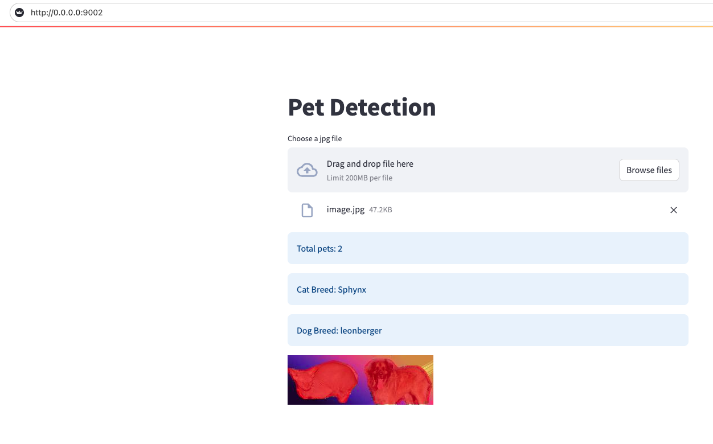

# PetNet: A Deep Neural Network for Semantic Segmentation and Breed Classification of Cats and Dogs


`PetNet` is a deep neural network designed for the semantic segmentation of images containing cats and dogs, as well as the classification of their respective breeds. This documentation provides an overview of PetNet, its network architecture, model training and evaluation processes, inference details, and testing instructions.


## Objectives
PetNet aims to:

1. Detect the presence of cats, dogs, or both in an image.
2. Classify the breed of the detected animal.
3. Generate a binary mask to distinguish pixels featuring a pet (cat or dog) from those that do not.

## Dataset
The network is trained on a dataset comprising 7,270 images of cats and dogs. It is further validated using a separate set of 1,818 images. Each image contains at most one cat and one dog.

## Network Architecture
PetNet is based on the U-Net architecture, incorporating a pre-trained RESNET-18 network as its backbone. It features two output heads: one for multi-label classification (covering pet type and breed type, with 39 labels in total) and another for semantic segmentation. The network is designed to detect at most one cat and one dog per image.

## Model Training
To train the model, follow these steps:

1. Download the dataset from this [link](https://github.com/harrison-ai/hai-tech-tasks/releases/download/v0.1/cats_and_dogs.zip). Ensure the data folder and the pets_dataset_info.csv file are placed within the dataset folder of the project.
2. Build the Docker image using:
```bash
docker build --platform linux/amd64 -t petnet:latest .
```
3. To run the docker image and train the model, use the following command:
```bash
docker run -it petnet:latest
python3 src/train.py
```
Hyperparameters can be adjusted in the `src/config.py` file. The best-performing model will be saved as `weights/model.pth`.


## Model Evaluation
The training and testing losses, along with accuracy metrics, are logged using Weights and Biases. Metrics such as mean classification precision, recall, segmentation IOU, and loss for both training and validation sets are recorded. The evaluation report is accessible [here](https://api.wandb.ai/links/qmaruf/48qzjuz9).

## Inference
PetNet features a REST API, served using FastAPI, for model inference. An accompanying user interface, built with Streamlit, facilitates interaction with the API. To deploy the API, follow these steps:
1. Build the Docker image as described in the Model Training section.
2. Launch the service using:
```bash
docker compose up
```
3. Access the UI at `http://0.0.0.0:9002`. Users can upload images and receive predictions, including pet type, breed, and the segmentation mask.


## Example UI Screenshot:


## Testing
Run unit tests by executing `pytest` from the root directory of the project.

## EDA
The EDA notebook is available [here](https://github.com/qmaruf/harrisonai/blob/main/notebook/harrison_pets.ipynb).